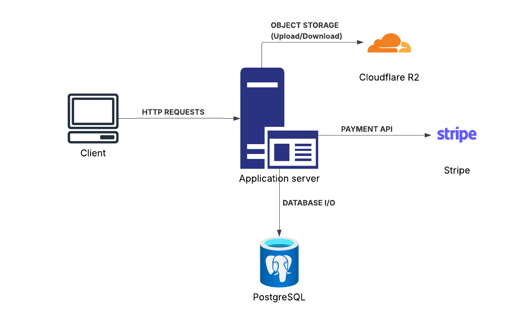

# Stelio

**Type:** Backend / Transactional System
**Focus:** Transactional safety, consistency, idempotency, state management

---

## 💡 Project Overview

A real-estate rental platform backend where users can list and rent properties. Built with Spring Boot, it prioritises:

- **Strong consistency** and transactional booking workflows
- **Idempotency** to protect against duplicate rentals and race conditions
- **File storage** via Cloudflare R2 (S3-compatible) for property images
- **JWT-based authentication** with token revocation
- **Messaging** between renters and property owners

---

## 🏗️ System Architecture & Design



---

## ⚙️ Core Features

### 1. Authentication & User Roles

- Register and login with JWT tokens (24-hour expiry)
- Logout invalidates the token via a server-side blacklist
- Three roles: **ADMIN**, **OWNER** (host), **RENTER**
- Renters can upgrade themselves to owners via `PATCH /api/users/{userId}`

### 2. Property Listings

- Owners can create, update, and delete properties
- Each property includes title, description, price, type (`APARTMENT`, `HOUSE`, `VILLA`, `CABIN`), address, city, guest/bed/bath counts, and multiple images
- Images are uploaded to **Cloudflare R2** and served via a public URL
- Properties have an `ACTIVE` / `INACTIVE` status; only active properties are shown publicly
- Renters can save properties to their **Favourites**

### 3. Transactional Booking Workflow

Booking is handled atomically:

1. Availability check (overlapping confirmed bookings are blocked with a pessimistic lock)
2. Reservation created with status `PENDING_PAYMENT` and a **10-minute TTL**
3. Payment processed via `POST /api/payments/{bookingId}` (minimum 30% on first payment)
4. Status advances to `CONFIRMED` when fully paid; expires automatically if not paid in time

### 4. Idempotency

- Booking requests require an **Idempotency-Key** header
- Prevents duplicate bookings and double charges on retried requests
- Keys expire after 24 hours; stale keys are cleaned up nightly

### 5. Booking Lifecycle (State Machine)

```
PENDING_PAYMENT → PENDING_APPROVAL → CONFIRMED → COMPLETED
                                   ↘ REJECTED
              ↘ CANCELLED
              ↘ EXPIRED
              ↘ NOSHOW
```

- **Owner** can approve, reject, or mark bookings as no-show
- **Renter** can cancel their own bookings
- Expired reservations are released automatically, returning the property to available

### 6. Messaging

- Renters and owners can exchange messages via conversations
- A conversation is automatically created when a booking request is submitted
- Conversations track unread counts and mute status per participant
- Conversations may optionally be linked to a review

### 7. Reviews

- Owners can view reviews and star ratings for their properties
- Review statistics (average stars, individual messages) are exposed via the API

### 8. Property Dashboard & Statistics

- Owners get a per-property dashboard: today's earnings, monthly earnings, occupancy rate, upcoming check-ins, pending reviews, booking counts by status
- A booking calendar endpoint returns confirmed/pending bookings as date ranges

### 9. Automated Cleanup

A scheduled task runs daily at **02:30 AM** to:

- Delete expired idempotency records
- Purge expired blacklisted JWT tokens

---

## 🏗️ Architecture

```
com/aaronjosh/real_estate_app/
├── controllers/     # REST API layer (11 controllers)
├── services/        # Business logic
├── repositories/    # Spring Data JPA repositories
├── models/          # JPA entities
├── dto/             # Request / response DTOs
│   ├── auth/
│   ├── booking/
│   ├── message/
│   ├── property/
│   └── payment/
├── security/        # JWT filter & Spring Security config
├── config/          # Application configuration beans
├── scheduler/       # Nightly cleanup jobs
├── util/            # Helpers (e.g. CloudflareR2Service)
└── exceptions/      # Custom exception types
```

### Data Model

| Entity              | Key Relationships                                                                                      |
| ------------------- | ------------------------------------------------------------------------------------------------------ |
| `users`             | owns many `property`, has many `bookings`, `favorites`, `reviews`, `messages`                          |
| `property`          | belongs to a `users` (host), has many `bookings`, `files`, `favorites`, `reviews`, one `propertyStats` |
| `bookings`          | belongs to `property` and `users` (renter); indexed on `(property_id, startDateTime, endDateTime)`     |
| `conversations`     | has many `participants` and `messages`; optionally linked to one `review`                              |
| `messages`          | sent by a `users`, belongs to a `conversation`, may have `files`                                       |
| `files`             | stored on Cloudflare R2; associated with either a `property` or a `message`                            |
| `propertyStats`     | one-to-one with `property`; aggregates booking and earnings data                                       |
| `blacklistedTokens` | stores revoked JWTs until they expire                                                                  |
| `idempotency`       | stores processed idempotency keys (24-hour TTL)                                                        |

---

## 🔒 Security

| Concern            | Approach                                                           |
| ------------------ | ------------------------------------------------------------------ |
| Authentication     | JWT (HMAC-SHA256), 24-hour expiry, `Authorization: Bearer <token>` |
| Token revocation   | Blacklist table checked on every request                           |
| Password storage   | BCrypt hashing                                                     |
| Session management | Stateless (no server-side sessions)                                |
| Concurrency safety | Pessimistic lock on overlapping booking query                      |
| Idempotency        | Per-user idempotency key with 24-hour TTL                          |

**Public endpoints** (no authentication required):

- `POST /api/auth/login`
- `POST /api/auth/register`
- `GET /api/properties/`
- `GET /api/properties/{propertyId}`
- `GET /api/image/**`

---

## 🌐 API Reference

### Auth — `/api/auth`

| Method | Path        | Description                          |
| ------ | ----------- | ------------------------------------ |
| `POST` | `/login`    | Authenticate and receive a JWT       |
| `POST` | `/register` | Create a new user account            |
| `POST` | `/logout`   | Revoke the current JWT               |
| `POST` | `/verify`   | Verify token and return user details |

### Users — `/api/users`

| Method  | Path        | Description                      |
| ------- | ----------- | -------------------------------- |
| `PATCH` | `/{userId}` | Upgrade role from RENTER → OWNER |

### Properties — `/api/properties`

| Method   | Path                     | Role   | Description                             |
| -------- | ------------------------ | ------ | --------------------------------------- |
| `GET`    | `/`                      | Public | List all active properties              |
| `GET`    | `/my-properties`         | OWNER  | List owner's properties                 |
| `GET`    | `/{propertyId}`          | Public | Property details with booking schedule  |
| `GET`    | `/{propertyId}/bookings` | OWNER  | Bookings for a specific property        |
| `POST`   | `/`                      | OWNER  | Create property (`multipart/form-data`) |
| `POST`   | `/{propertyId}`          | OWNER  | Update property details / images        |
| `DELETE` | `/{propertyId}`          | OWNER  | Delete property                         |

### Bookings — `/api/bookings`

| Method  | Path                  | Role   | Description                                           |
| ------- | --------------------- | ------ | ----------------------------------------------------- |
| `GET`   | `/`                   | Auth   | RENTER: own bookings; OWNER: all property bookings    |
| `GET`   | `/{bookingId}`        | Auth   | Get booking details                                   |
| `POST`  | `/{propertyId}`       | RENTER | Request a booking (requires `Idempotency-Key` header) |
| `PATCH` | `/{bookingId}`        | OWNER  | Update booking status                                 |
| `PATCH` | `/{bookingId}/cancel` | RENTER | Cancel booking                                        |

### Payments — `/api/payments`

| Method | Path           | Role | Description                                |
| ------ | -------------- | ---- | ------------------------------------------ |
| `POST` | `/{bookingId}` | Auth | Process payment (min 30% on first payment) |

### Messages — `/api/messages`

| Method | Path                | Description                     |
| ------ | ------------------- | ------------------------------- |
| `GET`  | `/`                 | List conversations (chat heads) |
| `POST` | `/`                 | Create new conversation         |
| `GET`  | `/{conversationId}` | Get messages in conversation    |
| `POST` | `/{conversationId}` | Send message                    |

### Favourites — `/api/favorite`

| Method   | Path            | Description               |
| -------- | --------------- | ------------------------- |
| `GET`    | `/{favoriteId}` | Check if favourite exists |
| `POST`   | `/{propertyId}` | Add to favourites         |
| `DELETE` | `/{propertyId}` | Remove from favourites    |

### Reviews — `/api/property/review`

| Method | Path                  | Role  | Description                     |
| ------ | --------------------- | ----- | ------------------------------- |
| `GET`  | `/stats/{propertyId}` | OWNER | Get review stats for a property |

### Property Stats — `/api/properties/stats`

| Method | Path                     | Role  | Description                   |
| ------ | ------------------------ | ----- | ----------------------------- |
| `GET`  | `/{propertyId}`          | OWNER | Property dashboard statistics |
| `GET`  | `/calendar/{propertyId}` | OWNER | Booking calendar              |

---

## 💻 Tech Stack

| Layer            | Technology                               |
| ---------------- | ---------------------------------------- |
| Language         | Java 21                                  |
| Framework        | Spring Boot 3.5                          |
| Security         | Spring Security + JJWT 0.12              |
| Persistence      | Spring Data JPA / Hibernate              |
| Database         | PostgreSQL                               |
| File Storage     | Cloudflare R2 (AWS SDK v2)               |
| Validation       | Jakarta Validation / Hibernate Validator |
| Utilities        | Lombok                                   |
| Containerisation | Docker (multi-stage build)               |

---

## 🚀 Getting Started

### Prerequisites

- Java 21+
- Maven 3.9+
- PostgreSQL database
- Cloudflare R2 bucket (or any S3-compatible storage)

### Environment Variables

Create a `.env` file in the project root (it is git-ignored):

```env
# Database
DB_URL=jdbc:postgresql://<host>:<port>/<database>
DB_USERNAME=<username>
DB_PASSWORD=<password>
DB_DRIVER=org.postgresql.Driver

# JWT
JWT_SECRET=<a-long-random-secret>

# Cloudflare R2
CLOUD_BUCKET_NAME=<bucket-name>
CLOUD_ENDPOINT=https://<account-id>.r2.cloudflarestorage.com
CLOUD_PUBLIC_URL=https://pub-<id>.r2.dev
CLOUD_ACCESS_KEY=<r2-access-key>
CLOUD_SECRET_KEY=<r2-secret-key>

# Server (optional, defaults to 8080)
PORT=8080
```

### Run Locally

```bash
# Clone the repository
git clone https://github.com/shironzi/stelio-backend.git
cd stelio-backend

# Build and run
./mvnw spring-boot:run
```

The API will be available at `http://localhost:8080`.

### Run with Docker

```bash
# Build the image
docker build -t stelio-backend .

# Run the container (pass env vars via --env-file)
docker run -p 8080:8080 --env-file .env stelio-backend
```

### Run Tests

```bash
./mvnw test
```
